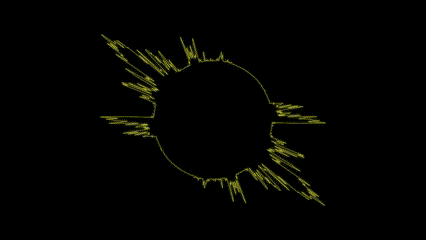
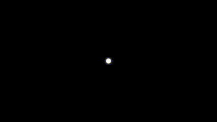

# VisualSound

## 1. Projektbeschreibung

**VisualSound** ist eine interaktive Webanwendung zur visuellen Darstellung von Audiosignalen. Sie ermöglicht die dynamische Visualisierung von Audioeingaben mithilfe verschiedener Visualisierungstechniken, wie z. B. Wellenform-, Frequenz-, Kreis- und Ball-Visualisierungen.

Die Anwendung bietet eine intuitive Benutzeroberfläche zur Auswahl des Audioeingabegeräts und zur Konfiguration der Visualisierungseinstellungen. Sie eignet sich sowohl für Musiker, die ihre Klänge visualisieren möchten, als auch für Sound-Enthusiasten, Veranstalter und DJs, die visuelle Effekte in ihre Performances integrieren möchten.

**VisualSound** nutzt die Web Audio API zur Verarbeitung von Audiodaten und bietet erweiterte Funktionen wie Farbsteuerung, Vollbildmodus und verschiedene Visualisierungsmodi.

## 2. Features

- Echtzeit-Audioanalyse über die **Web Audio API**
- Verschiedene Visualisierungen: Wellenform, Frequenzspektrum, Kreis- und Ballvisualisierungen
- Anpassbare Farben für individuelle Visualisierungserlebnisse
- Fullscreen-Modus für eine immersive Darstellung
- Auswahl des Audioeingabegeräts (Mikrofon, Line-In, Kabel-Eingang, Standardgerät)
- Unterstützung für mehrere Visualisierungen gleichzeitig
- Benutzerfreundliche Steuerung und intuitive Bedienung

## 3. Installation

### 3.1 Voraussetzungen

Stelle sicher, dass folgende Software auf deinem Computer installiert ist:

1. **Node.js** (Version 14 oder höher)
    - [Download Node.js](https://nodejs.org/) und folge der Installationsanleitung für dein Betriebssystem.
    - Überprüfen der Installation:
    
    ```bash
    node -v
    npm -v
    ```
    
    Du solltest die installierten Versionen von Node.js und npm sehen.
    
2. **Git**
    - [Download Git](https://git-scm.com/) und folge der Installationsanleitung.
    - Überprüfen der Installation:
    
    ```bash
    git --version
    ```
    

### 3.2 Projekt herunterladen

Öffne ein Terminal (Eingabeaufforderung, PowerShell, Terminal auf macOS oder Linux) und gib folgende Befehle ein:

```bash
# Navigiere zu dem Ordner, in dem du das Projekt speichern möchtest
cd dein/speicherort

# Klone das Repository
git clone https://gitlab.mi.hdm-stuttgart.de/lg109/visualsound.git

# Wechsle in das Projektverzeichnis
cd visualsound
```

### 3.3 Abhängigkeiten installieren

Bevor du das Projekt starten kannst, müssen alle benötigten Bibliotheken und Abhängigkeiten installiert werden:

```bash
npm install
```

Dieser Befehl liest die **package.json** Datei ein und installiert alle erforderlichen Pakete.

### 3.4 Entwicklungsserver starten

Um die Anwendung lokal zu starten, verwende:

```bash
npm start
```

Wenn alles korrekt eingerichtet ist, sollte der Server starten und dir mitteilen, dass die Anwendung unter http://localhost:3000 verfügbar ist.

Öffne deinen Browser und gehe zu dieser Adresse.

### 3.5 Typische Probleme und Lösungen

- **Fehler: 'npm' wird nicht erkannt:** Stelle sicher, dass Node.js und npm korrekt installiert sind.
- **Port 3000 ist belegt:** Schließe andere Anwendungen, die diesen Port nutzen, oder starte deinen Computer neu.
- **Berechtigungsprobleme:** Starte das Terminal als Administrator (Rechtsklick > "Als Administrator ausführen").

## 4. Abhängigkeiten

Um das bestmögliche Erlebnis mit **VisualSound** zu gewährleisten, sind folgende Voraussetzungen und Empfehlungen zu beachten:

### Hardware-Empfehlung

- **Bildschirmformat:** Optimal ist ein Bildschirm im **16:9-Format**. Andere Formate funktionieren zwar, können jedoch das Canvas verzerren und das visuelle Erlebnis beeinträchtigen.

### Software-Empfehlung

- **Browser:** Verwende **Google Chrome**, da andere Browser bisher nicht getestet wurden.
- **Berechtigungen:** Stimme der **Mikrofonanfrage** im Browser zu, um Audioeingaben zu ermöglichen.

### Audioeingabe-Optionen

1. **Standard (Mikrofon):** Bei der Nutzung eines Mikrofons muss die Berechtigung im Browser erteilt werden.
2. **Direktes Einspeisen des System-Sounds:**
    - Wenn du nicht über das Mikrofon aufnehmen, sondern direkt den System-Sound einspeisen möchtest, nutze folgende Software:

### macOS: **BlackHole**

- [BlackHole herunterladen](https://existential.audio/blackhole/)
- Erstelle ein **Multi-Output-Gerät** im **Audio-MIDI-Setup**.
- Wähle **BlackHole** als Audioeingabegerät in der **VisualSound**Anwendung.

### Windows: **VB-Audio Cable Input**

- [VB-Audio Virtual Cable herunterladen](https://vb-audio.com/Cable/)
- Wähle **Cable Input** als Standardaufnahmegerät unter **Systemsteuerung > Sound > Aufnahmegeräte**.
- Stelle die Audioausgabe deines Systems auf **Cable Output**, um den Sound direkt in **VisualSound** zu nutzen.

## 5. Screenshots

### Waveform Visualizer


### Frequency Visualizer


### Circle Visualizer



### Ball Visualizer



## 6. Projektstruktur

```graphql
src
├── components
│   ├── AppLogic               # Logik-Komponenten der Anwendung
│   │   ├── AudioContextProvider.js  # Bietet den globalen Audio-Kontext
│   │   ├── DeviceSelector.js       # Auswahl des Audioeingabegeräts
│   │   ├── FullscreenContainer.js  # Verwaltung des Vollbildmodus
│   │   └── VisualizerSelector.js   # Auswahl und Konfiguration der Visualisierungen
│   │
│   ├── AudioVisualizer        # Visualisierungskomponenten
│   │   ├── BallVisualizer.js        # Dynamische Ball-Visualisierung
│   │   ├── CircleVisualizer.js      # Kreisförmige Visualisierung
│   │   ├── configs.js               # Konfiguration der verfügbaren Visualisierer
│   │   ├── FrequencyVisualizer.js   # Darstellung des Frequenzspektrums
│   │   ├── MasterVisualizer.js      # Kombiniert alle Visualisierungen
│   │   └── WaveformVisualizer.js    # Wellenformdarstellung des Audios
│
├── styles
│   └── App.css                # Zentrale Stildefinitionen
│
├── utils                      # Hilfsfunktionen und Audio-Setup
│   ├── audioCalculations.js   # Berechnungen für die Ball-Visualisierung
│   ├── audioSetup.js          # Initialisierung des Audio-Kontexts und Analyser
│   └── index.js               # Bündelt alle Utils für den einfachen Import
│
├── App.js                     # Hauptkomponente der Anwendung
└── index.js                   # Einstiegspunkt der React-Anwendung

```

## 7. Autoren und Anerkennung

**VisualSound** wurde mit Leidenschaft entwickelt von:

- **Projektleitung:** Leon van Gaever
- **Entwickler:** Leon van Gaever, Felix Schuldt
- **Design:** Felix Schuldt

Ein besonderer Dank gilt:

- **Existential Audio** für das Tool **BlackHole** (macOS)
- **VB-Audio** für das **VB-Audio Cable Input** (Windows)
- Den Entwicklern der **Web Audio API**, die dieses Projekt möglich gemacht haben

Falls du ebenfalls zum Projekt beigetragen hast und hier genannt werden möchtest, öffne gerne einen **Merge Request**!

## 8. Informationen

**VisualSound** ist im Rahmen eines universitären Projekts an der **Hochschule der Medien (HdM)** in Stuttgart-Vaihingen entstanden. Das Projekt wurde innerhalb eines halben Jahres entwickelt und diente primär zu Studien- und Demonstrationszwecken.

Es handelt sich hierbei um einen **Prototypen**, der möglicherweise in der Zukunft weitergeführt wird, jedoch derzeit **nicht aktiv entwickelt** wird. Aufgrund des experimentellen Charakters können noch zahlreiche **Fehler und Bugs** auftreten. Nutzer sollten das Projekt eher als **Konzeptstudie** betrachten und keine vollständige Produktreife erwarten.

Dennoch sind Feedback, Ideen und Beiträge jederzeit willkommen, um das Projekt weiterzuentwickeln oder es als **Inspiration** für ähnliche Anwendungen zu nutzen.
